<picture>
  <source media="(prefers-color-scheme: dark)" srcset="./assets/profile-banner-dark.svg">
  <source media="(prefers-color-scheme: light)" srcset="./assets/profile-banner-light.svg">
  
</picture>

  
  

  

## About me

I turn document-heavy and operational processes into practical applications—from requirements analysis and proposal workflows to business systems, APIs, and distributed services.

- I build **AI-assisted document processing and workflow automation**.
- I deliver **full-stack products** with React, TypeScript, Python, and Java.
- I work across **APIs, background jobs, data, and containerized services**.
- I enjoy creating focused tools that make complex work easier to understand and operate.

Some earlier coursework and academic projects also live at <a href="https://github.com/GustavoSotoAedo">@GustavoSotoAedo</a>.

## Selected public work

<table>
  <tr>
    <td width="50%" valign="top">
      <h3><a href="https://github.com/gugasito/licitai2">licitAI</a></h3>
      
A FastAPI and React workspace for processing tender documents, tracking requirements, validating workflow gates, and producing structured proposal artifacts.

      

        
        
        
        
      

      
<a href="https://github.com/gugasito/licitai2"><strong>Explore the project →</strong></a>

    </td>
    <td width="50%" valign="top">
      <h3><a href="https://github.com/gugasito/OpenLPConverter">OpenLPConverter</a></h3>
      
A Python desktop utility that converts OpenLP song libraries from XML into text files for presentation workflows, with batch processing and visible progress.

      

        
        
        
      

      
<a href="https://github.com/gugasito/OpenLPConverter"><strong>Explore the project →</strong></a>

    </td>
  </tr>
  <tr>
    <td width="50%" valign="top">
      <h3><a href="https://github.com/gugasito/GameFinder">GameFinder</a></h3>
      
An earlier collaborative Java desktop project for browsing and filtering a local game catalog, reflecting my foundations in OOP, GUI development, persistence, and teamwork.

      

        
        
        
      

      
<a href="https://github.com/gugasito/GameFinder"><strong>Explore the project →</strong></a>

    </td>
    <td width="50%" valign="top">
      <h3>Private case studies</h3>
      
Selected professional and academic work is described anonymously to protect organizations, operational data, credentials, and sensitive implementation details.

      
<strong>AI automation · Distributed systems · Business platforms · Operational dashboards</strong>

      
<a href="#selected-private-work"><strong>View anonymized experience ↓</strong></a>

    </td>
  </tr>
</table>

## Technology map

  <picture>
    <source media="(prefers-color-scheme: dark)" srcset="https://skillicons.dev/icons?i=python,ts,java,go,rust,fastapi,spring,react,angular,postgres,mysql,mongodb,redis,kafka,docker,githubactions&amp;perline=8&amp;theme=dark">
    <source media="(prefers-color-scheme: light)" srcset="https://skillicons.dev/icons?i=python,ts,java,go,rust,fastapi,spring,react,angular,postgres,mysql,mongodb,redis,kafka,docker,githubactions&amp;perline=8&amp;theme=light">
    
  </picture>

  
  
  

## Selected private work

  
<strong>AI-assisted proposal automation</strong>

   
  Built full-stack workflows for extracting requirements from tender documents, tracking evidence and review gates, and producing structured technical artifacts.

  
<strong>Distributed scoring platform</strong>

   
  Contributed to a Python and Go microservices system using Kafka, gRPC, transactional outbox, sagas, sharding, and end-to-end observability.

  
<strong>Business operations platform</strong>

   
  Developed a multi-client accounting system covering ledger entries, purchases, fees, financial books, reports, migrations, and backups.

  
<strong>Structured academic feedback</strong>

   
  Built a Spring Boot and React workflow that transforms spreadsheet data into validated, structured feedback using an AI model.

  
<strong>Operational dashboards</strong>

   
  Delivered applications for monitoring, reporting, data entry, exports, and decision support across several real-world domains.

## What I'm looking for

I'm open to software development opportunities where I can contribute across product, backend, and full-stack engineering—especially work involving AI-assisted workflows, document automation, APIs, or operational systems.

I value teams that care about clear problem framing, practical delivery, and software that makes complex work easier to understand and operate.

## Connect

  <strong>Based in Temuco, Chile · Open to local and remote opportunities</strong>

<!-- Add LinkedIn and professional email badges here after the links are confirmed. -->
